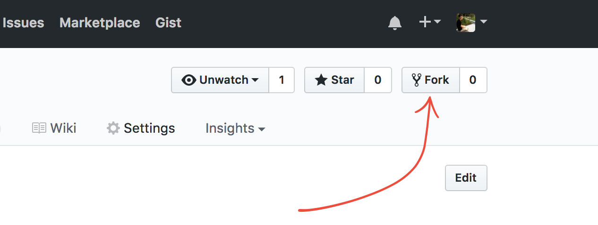

# Studio Scavenger Hunt
A scavenger hunt to start off a new year of ScriptEd Studio

- [Overview](#overview)
- [Setup](#project-setup)
- [Scavenger Hunt!](#scavenger-hunt)

## Overview
The beginning of first session should be allotted for icebreakers, expectations,
and a company orientation. Students will then pair up to complete the challenges
below that will test their skills on topics covered in previous years of
ScriptEd years.

## Project Extensions
Students that finish early should `//TODO(devrajm) add extensions`

## Project Setup

1. Fork this repo so you have your own repo to save your work.

   
   
1. Add your partner as a collaborator to your repo so you can both make commits
   and work in parallel.

   

1. Complete the challenges!
1. After completing a challenge or section commit and push your changes to your
   repo to save your work.

   _Forget how to do that? No worries! Take a few minutes to go through this
   tutorial [try.github.io]_

1. If you want to keep track of your progress change the `[ ]` to `[x]` in your
   fork's `README.md` to check off the checkboxes:
   - [x] Challenge complete!

## Scavenger Hunt!

### HTML

- [ ] Create an `index.html` file in your fork of this repo and add the
  following html to it:
- [ ] The title of the page should be "ScriptEd Scavengers!"
- [ ] There should be a header on the page that contains the text "Hello
  Studio!"
- [ ] There should be a smaller header on the page that contains you and your
  partner's names.
- [ ] Add a paragraph element with a paragraph of text from <lipsum.com>.

### CSS

- [ ] Create an `index.css` file.
- [ ] Link the css file from the html file.
- [ ] The headers on the page should be centered, but not the other text on the
  page.
- [ ] The headers should be in a [sans serif font] and the rest of the text
  should be a [serif font].
- [ ] The page should have a [taupe] background.

### JavaScript & jQuery

- [ ] Create an `index.js` file.
- [ ] Import your js file from your html file.
- [ ] Import a jQuery library from you html file. _Note your `index.js` file
  will use jQuery so import order matters._

### GitHub

- [ ] When finished with all the above challenges, commit and push all of your
  changes, and send a [pull request] to the repo that you forked.

[try.github.io]: https://try.github.io
[sans serif font]: https://en.wikipedia.org/wiki/sans-serif
[serif font]: https://en.wikipedia.org/wiki/serif
[taupe]: https://en.wikipedia.org/wiki/taupe
[pull request]: https://help.github.com/articles/creating-a-pull-request/
